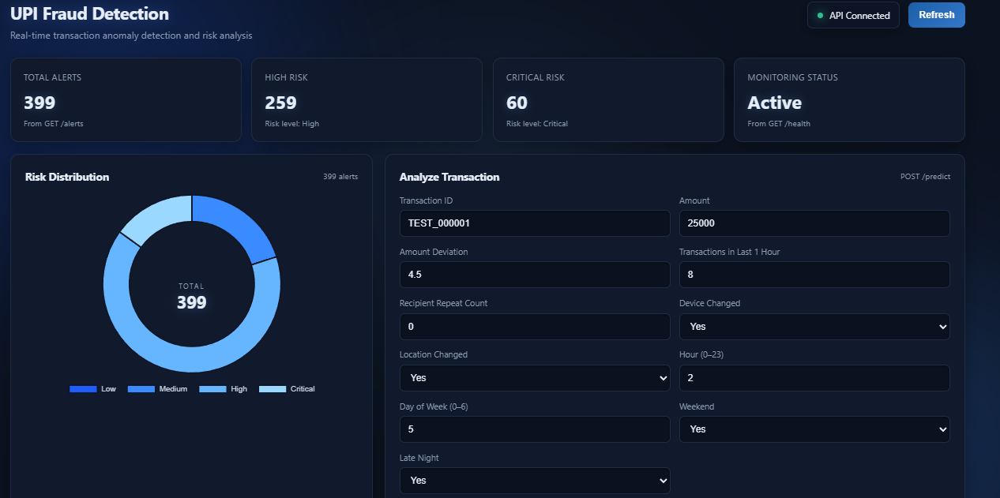
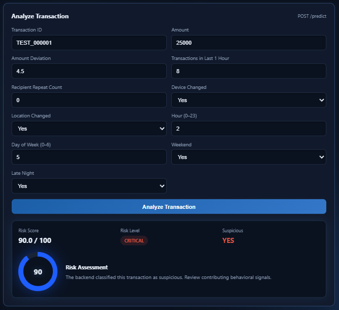
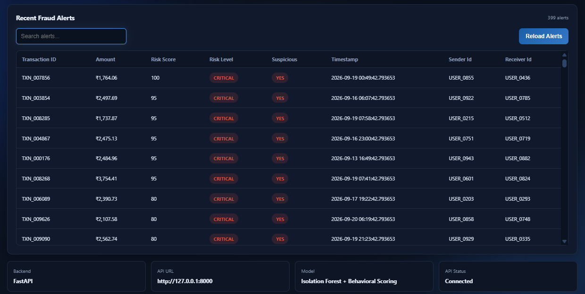

# UPI Fraud Detection System

An end-to-end **UPI transaction fraud and anomaly detection system** built using Python, Machine Learning, FastAPI, and an interactive web dashboard.

The system analyzes transaction behavior, detects suspicious patterns, calculates a risk score, and exposes the detection pipeline through a REST API and dashboard.

---

## 🚀 Features

* Synthetic UPI transaction dataset generation
* Behavioral feature engineering
* IQR-based statistical anomaly detection
* Isolation Forest anomaly detection
* Transaction burst detection
* Device and location change detection
* Late-night transaction detection
* Time-series anomaly detection
* Weighted fraud risk scoring
* Risk classification: Low, Medium, High, Critical
* FastAPI REST API
* Interactive fraud detection dashboard
* Fraud alert monitoring
* Transaction-level risk analysis
* Model evaluation using precision, recall, F1-score, and false-positive rate

---

## 🏗️ System Architecture

```text
UPI Transaction Data
        │
        ▼
Feature Engineering
        │
        ├── Amount Deviation
        ├── Transaction Frequency
        ├── Recipient Behavior
        ├── Device Change
        ├── Location Change
        ├── Time Features
        └── Late-Night Activity
        │
        ▼
Anomaly Detection
        │
        ├── IQR Detection
        ├── Isolation Forest
        └── Time-Series Analysis
        │
        ▼
Behavioral Risk Scoring
        │
        ▼
Risk Classification
        │
        ├── Low
        ├── Medium
        ├── High
        └── Critical
        │
        ▼
FastAPI
        │
        ▼
Interactive Dashboard
```

---

## 🧠 Machine Learning Approach

The system uses a **hybrid anomaly detection approach** that combines statistical analysis, machine learning, and transaction behavior.

### 1. Feature Engineering

The following behavioral features are generated for each transaction:

* Amount deviation from normal user behavior
* Number of transactions in the last 1 hour
* Recipient repeat count
* Device change indicator
* Location change indicator
* Transaction hour
* Day of week
* Weekend indicator
* Late-night transaction indicator

These features help identify unusual transaction behavior rather than relying only on transaction amount.

### 2. IQR-Based Anomaly Detection

The **Interquartile Range (IQR)** method is used to identify statistical outliers in transaction behavior.

Transactions falling outside the calculated IQR boundaries receive an anomaly signal.

### 3. Isolation Forest

**Isolation Forest** is used as an unsupervised anomaly detection model.

It identifies transactions that are significantly different from the general transaction population.

### 4. Behavioral Signals

Additional behavioral signals are incorporated into the final risk score:

* Transaction bursts
* Device changes
* Location changes
* Late-night activity
* Time-series anomalies

### 5. Final Risk Score

The final risk score is calculated using weighted anomaly and behavioral signals.

| Signal              | Weight |
| ------------------- | -----: |
| IQR Anomaly         |     15 |
| Isolation Forest    |     35 |
| Transaction Burst   |     25 |
| Device Changed      |      5 |
| Location Changed    |      5 |
| Late Night          |      5 |
| Time-Series Anomaly |     10 |

The final alert threshold is **50**.

### Risk Classification

| Risk Score | Risk Level |
| ---------: | ---------- |
|       0–29 | Low        |
|      30–49 | Medium     |
|      50–69 | High       |
|     70–100 | Critical   |

---

## 📊 Model Evaluation

The final risk-scoring system was evaluated against the suspicious-transaction labels generated during the synthetic dataset creation process.

At the selected risk-score threshold of **50**, the system achieved:

| Metric              | Result |
| ------------------- | -----: |
| Precision           | 43.36% |
| Recall              | 34.60% |
| F1 Score            | 38.49% |
| False Positive Rate |  2.38% |

### Model / Method Comparison

| Model / Method        | Purpose                             |
| --------------------- | ----------------------------------- |
| Logistic Regression   | Baseline classification             |
| Decision Tree         | Classification using decision rules |
| Random Forest         | Ensemble classification             |
| Isolation Forest      | Unsupervised anomaly detection      |
| IQR                   | Statistical outlier detection       |
| Behavioral Risk Score | Final fraud-alert decision          |

### Evaluation Limitation

The dataset used in this project is **synthetically generated**, and suspicious transactions were injected using predefined behavioral patterns.

Therefore, the reported metrics are intended to demonstrate the implementation and evaluation workflow and **should not be interpreted as real-world fraud detection performance**.

A production fraud detection system would require historical transaction data, confirmed fraud labels, continuous monitoring, threshold optimization, and validation against real-world fraud cases.

---

## 📸 Dashboard Preview

The project includes an interactive dashboard for monitoring suspicious UPI transactions and analyzing individual transactions.

### Dashboard Overview



The main dashboard provides:

* Total transaction statistics
* Fraud alert statistics
* Risk distribution
* Interactive transaction analysis
* Recent fraud alerts
* API connection status

### Transaction Risk Analysis



The transaction analyzer allows users to submit transaction characteristics and receive a calculated:

* Risk score
* Risk level
* Fraud alert status
* Prediction result

### Fraud Alerts



The fraud alert table provides transaction-level visibility into suspicious activity and allows users to review detected alerts.

---

## 🔌 API Usage

The project provides a **FastAPI REST API** for transaction risk analysis.

### Start the API

```bash
conda activate upi-fraud
D:
cd D:\UPI-Fraud-Detection

python -m uvicorn api.main:app --host 127.0.0.1 --port 8000
```

### Health Check

```http
GET /health
```

Example response:

```json
{
  "status": "healthy",
  "service": "UPI Fraud Detection API"
}
```

### Predict Transaction Risk

```http
POST /predict
```

Example request:

```json
{
  "transaction_id": "TEST_000001",
  "amount": 25000,
  "amount_deviation": 4.5,
  "transactions_last_1h": 8,
  "recipient_repeat_count": 0,
  "device_changed": 1,
  "location_changed": 1,
  "hour": 2,
  "day_of_week": 5,
  "is_weekend": 1,
  "is_late_night": 1
}
```

Example response:

```json
{
  "transaction_id": "TEST_000001",
  "risk_score": 78,
  "risk_level": "Critical",
  "is_alert": true
}
```

### Available Endpoints

| Method | Endpoint                        | Description                  |
| ------ | ------------------------------- | ---------------------------- |
| GET    | `/`                             | API information              |
| GET    | `/health`                       | API health check             |
| POST   | `/predict`                      | Predict transaction risk     |
| GET    | `/alerts`                       | Retrieve fraud alerts        |
| GET    | `/transaction/{transaction_id}` | Retrieve transaction details |

Interactive API documentation:

```text
http://127.0.0.1:8000/docs
```

---

## 📁 Project Structure

```text
UPI-Fraud-Detection/
│
├── api/
│   ├── __init__.py
│   ├── main.py
│   ├── predictor.py
│   └── schemas.py
│
├── dashboard/
│   └── fraud-detection-dashboard.html
│
├── data/
│   ├── raw/
│   │   └── upi_transactions.csv
│   │
│   └── processed/
│       ├── features.csv
│       └── alerts.csv
│
├── images/
│   ├── dashboard-overview.png
│   ├── transaction-analysis.png
│   └── fraud-alerts.png
│
├── models/
│   ├── isolation_forest.pkl
│   ├── iqr_metadata.pkl
│   └── model_metadata.pkl
│
├── notebooks/
│
├── .gitignore
├── README.md
└── requirements.txt
```

---

## 🛠️ Tech Stack

### Programming

* Python

### Data Processing

* Pandas
* NumPy

### Machine Learning

* Scikit-learn
* Isolation Forest

### Statistical Analysis

* IQR-based anomaly detection

### API

* FastAPI
* Uvicorn
* Pydantic

### Visualization

* HTML
* CSS
* JavaScript
* Chart.js

### Development

* Jupyter
* Anaconda
* Git
* GitHub

---

## ▶️ How to Run

### 1. Clone the Repository

```bash
git clone https://github.com/Abhinav1805003/UPI-Fraud-Detection.git
cd UPI-Fraud-Detection
```

### 2. Create / Activate the Environment

```bash
conda activate upi-fraud
```

### 3. Install Dependencies

```bash
pip install -r requirements.txt
```

### 4. Start the FastAPI Server

```bash
python -m uvicorn api.main:app --host 127.0.0.1 --port 8000
```

### 5. Open the API Documentation

```text
http://127.0.0.1:8000/docs
```

### 6. Open the Dashboard

Open:

```text
dashboard/fraud-detection-dashboard.html
```

with the FastAPI server running.

---

## ⚠️ Limitations

* Dataset is synthetically generated.
* Fraud labels are based on injected behavioral patterns.
* Evaluation metrics are therefore illustrative.
* Real-world fraud detection requires historical confirmed-fraud data.
* The current API prediction endpoint evaluates the provided transaction features without maintaining a live transaction history.
* Time-series context requires historical transaction data for reliable production implementation.

---

## 🔮 Future Improvements

* Train and validate using real-world transaction datasets
* Add real-time transaction streaming
* Implement user-level behavioral baselines
* Add explainable AI for individual fraud predictions
* Add automated model retraining
* Add database integration
* Add authentication and API security
* Deploy the FastAPI service to the cloud
* Add production monitoring and model drift detection

---

## 👨‍💻 Author

**Abhinav Yadav**

B.Tech Computer Science Engineering

GitHub: https://github.com/Abhinav1805003
